<div align="center">

# AskHR — 사내 규정 AI 챗봇

**내부 규정을 몰라도, 얘기만 해도 알려줍니다.**

사원이 자신의 상황을 자연어로 설명하면 사내 규정 문서를 근거로 이해하기 쉬운 답변을 주고,
운영자는 대시보드에서 응답 지연시간과 토큰 사용량을 확인하는 사내 FAQ AI 챗봇입니다.

[](https://2026aio2ask-hr-frontend-qmyw7a2qrnz7gfsvy5rrnc.streamlit.app/)
[](https://two026-aio2-ask-hr-backend.onrender.com/docs)


**[🚀 서비스 바로가기](https://2026aio2ask-hr-frontend-qmyw7a2qrnz7gfsvy5rrnc.streamlit.app/)** · **[📖 API 문서 (Swagger)](https://two026-aio2-ask-hr-backend.onrender.com/docs)**

AIO 2기 · 삼 팀 · 개발 2026.09.07 – 09.08 · 발표 2026.09.09

</div>

---

## 목차

- [문제와 해결](#문제와-해결)
- [스크린샷](#스크린샷)
- [주요 기능](#주요-기능)
- [아키텍처](#아키텍처)
- [기술 스택](#기술-스택)
- [화면 흐름](#화면-흐름)
- [데이터 모델](#데이터-모델)
- [설계 포인트](#설계-포인트)
- [대표 질문 (DoD)](#대표-질문-dod)
- [산출물](#산출물)
- [저장소 구조](#저장소-구조)
- [로컬 실행](#로컬-실행)
- [알려진 제한과 다음 단계](#알려진-제한과-다음-단계)
- [팀](#팀)

---

## 문제와 해결

| 문제 | AskHR의 해결 |
|---|---|
| 연차·경조사·복지·출장비·IT 이용 등 규정의 **정확한 명칭을 모른다** | 규정 용어 없이 평소 쓰는 문장으로 질문 |
| 규정 문서가 여러 파일에 **흩어져 있어** 찾는 데 오래 걸린다 | 질문 키워드로 관련 규정만 골라 근거로 사용 |
| 기존 FAQ는 **검색어를 정확히** 입력해야 한다 | 자연어 상황 설명을 그대로 이해 |
| 단순 LLM 답변은 **근거와 신뢰성**을 확인하기 어렵다 | 답변 마지막 줄에 `[규정명 > 항목명]` 근거 표기, 규정에 없으면 "규정에 없는 내용입니다" |

**타깃 사용자**: 입사 초기라 사내 규정과 업무 절차에 익숙하지 않은 임직원. 긴 원문보다 결론과 신청 방법을 빠르게 알고 싶고, 이어지는 질문을 처음부터 다시 설명하고 싶지 않은 사람.

---

## 스크린샷

<table>
  <tr>
    <td align="center"><b>로그인</b><br>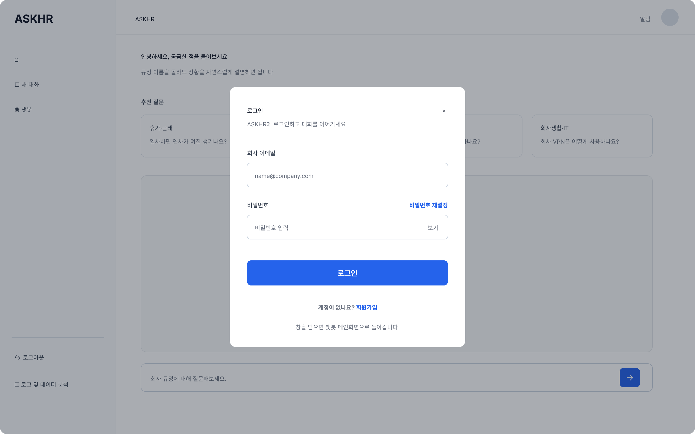</td>
    <td align="center"><b>홈 · 환영 화면</b><br>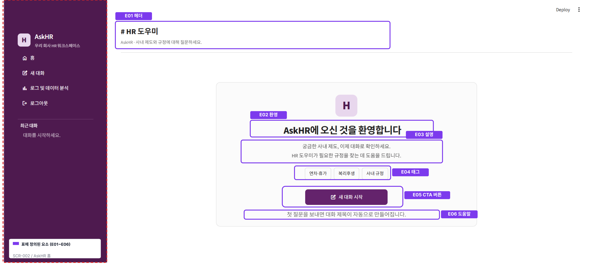</td>
  </tr>
  <tr>
    <td align="center"><b>답변 스트리밍</b><br>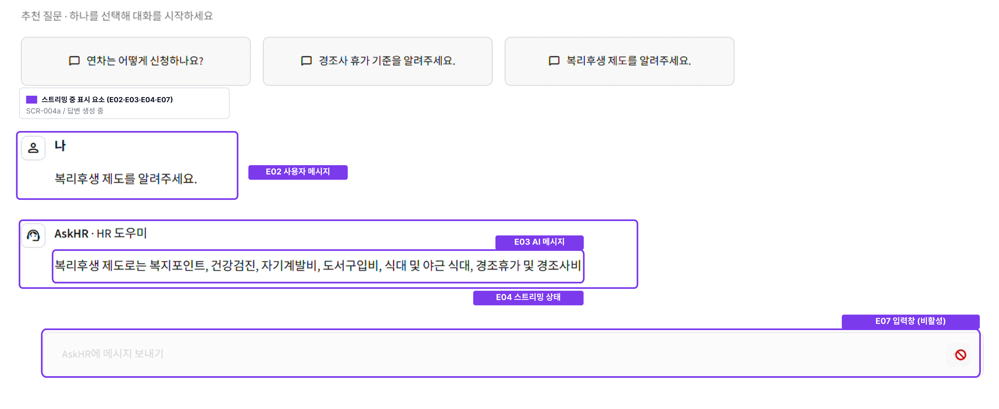</td>
    <td align="center"><b>답변 완료 + 근거 표기</b><br>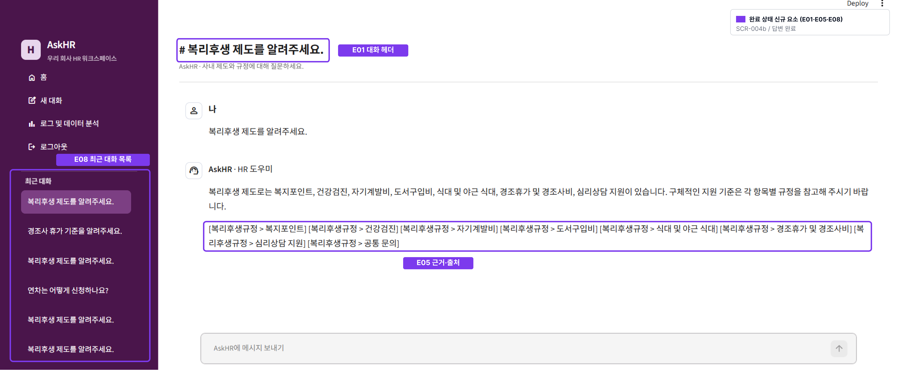</td>
  </tr>
  <tr>
    <td align="center"><b>대시보드 · 활동 개요</b><br>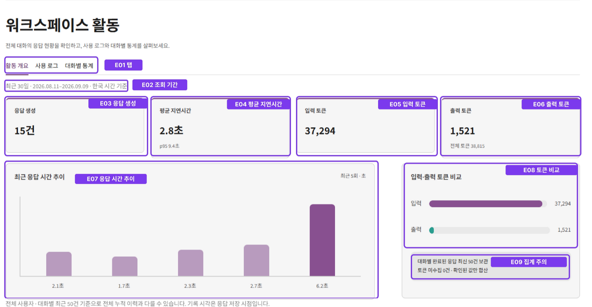</td>
    <td align="center"><b>대시보드 · 사용 로그</b><br>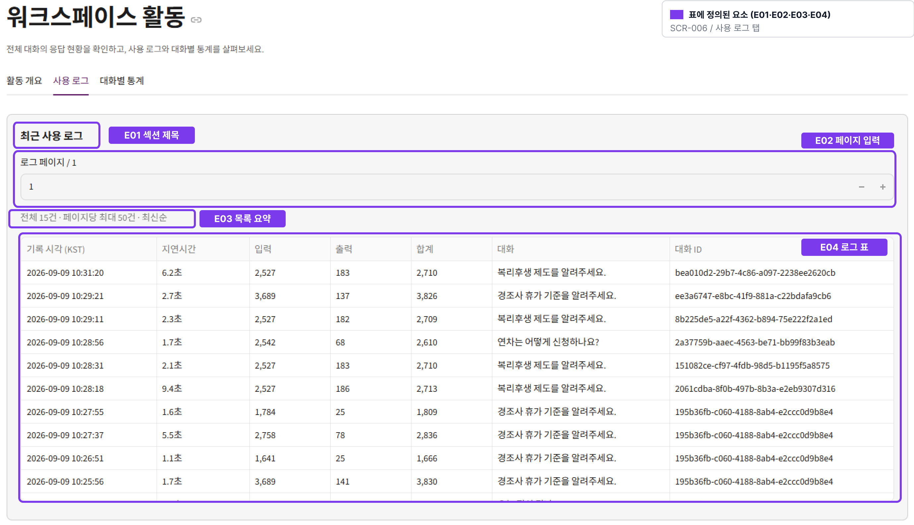</td>
  </tr>
</table>

<details>
<summary>더 보기 — 새 대화 · 대화별 통계 · 사이드바 · 회원가입 · 로그아웃</summary>
<br>
<table>
  <tr>
    <td align="center"><b>새 대화 (추천 질문)</b><br>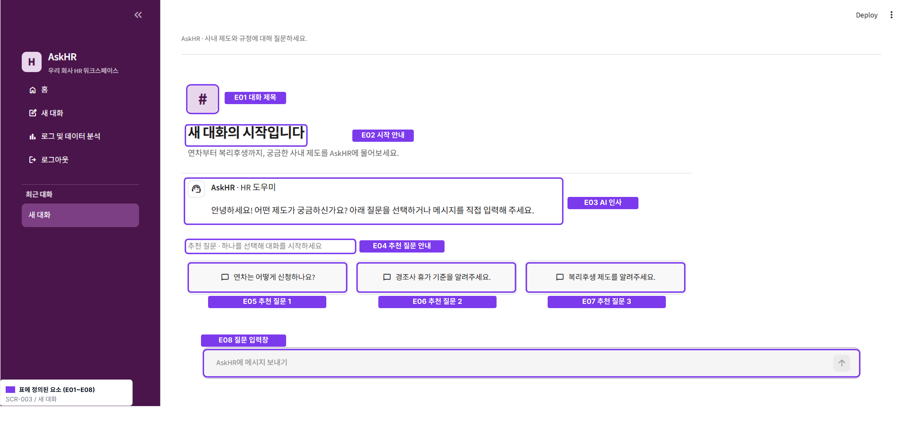</td>
    <td align="center"><b>대시보드 · 대화별 통계</b><br>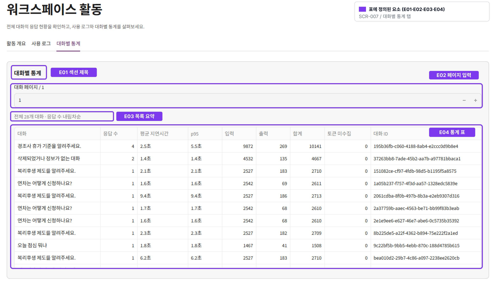</td>
  </tr>
  <tr>
    <td align="center"><b>회원가입 팝업</b><br>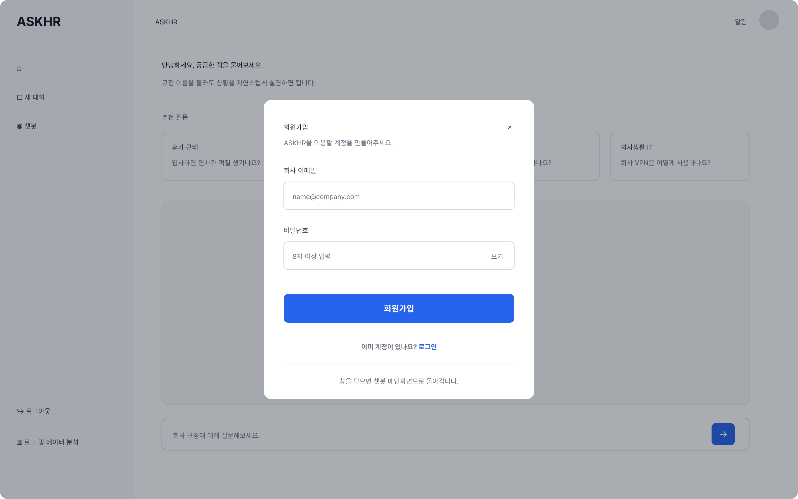</td>
    <td align="center"><b>로그아웃 확인</b><br>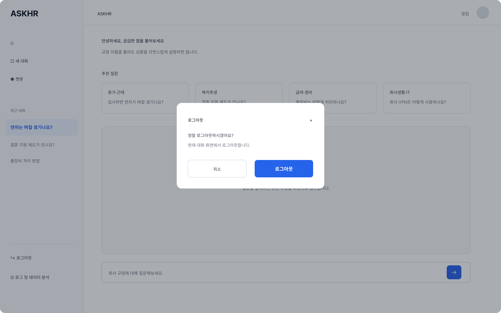</td>
  </tr>
</table>
</details>

---

## 주요 기능

| 기능 | 설명 |
|---|---|
| **자연어 질문** | 규정 명칭 없이 상황을 설명하면 질문 의도를 파악해 답변. 빈 질문은 전송되지 않음 |
| **근거 기반 답변** | 질문 키워드로 8종 규정 MD 중 관련 문서만 골라 Gemini 프롬프트에 삽입. 규정 밖 내용은 지어내지 않음 |
| **실시간 스트리밍** | 답변을 SSE로 조각 단위 전달. 완료 후 저장본과 자동 생성된 대화 제목으로 갱신 |
| **근거·출처 표기** | 답변 마지막 줄에 `[복리후생규정 > 복지포인트]` 형식으로 참고 항목 표시 |
| **후속 질문 (Context)** | 최근 20개 발언을 유지해 "그럼 신청할 땐 뭘 내야 해?" 같은 이어지는 질문 처리 |
| **대화 관리** | 새 대화 생성(주제별 Context 분리) · 최근 대화 목록 · 삭제. 첫 질문이 대화 제목이 됨 |
| **회원가입 · 로그인** | Supabase Auth 이메일/비밀번호. 세션 만료 시 기록은 유지되고 재로그인만 안내 |
| **사용량 대시보드** | 응답 수 · 평균/p95 지연시간 · 입력/출력 토큰 · 최근 5회 응답 시간 추이 · 사용 로그 · 대화별 통계 |
| **범위 밖 처리** | 개인 급여 조회 등은 "지원하지 않음"으로 안내하고 담당 부서로 연결. 프롬프트 우회 시도 거부 |

---

## 아키텍처

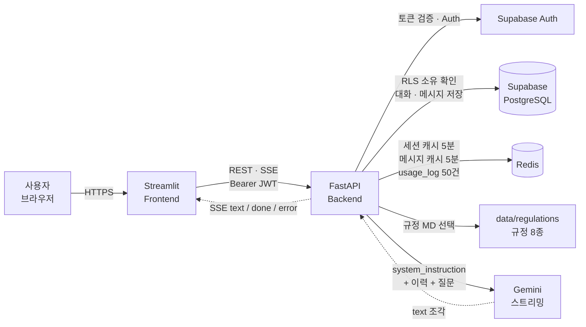

### 채팅 요청 처리 순서

1. Streamlit이 `POST /conversations/{id}/chat`을 JWT와 함께 호출
2. 토큰 검증(Redis 세션 캐시 → miss면 Supabase) · RLS로 대화 소유 확인 — 없는 대화와 남의 대화는 똑같이 404
3. 대화 이력 조회: Redis 캐시 hit이면 Redis, miss면 Supabase → 마지막 `system` 메시지 이후 최근 20개로 축약
4. 질문 키워드로 `data/regulations/` 중 관련 MD만 선택·로드 (후속 질문이면 직전 질문의 주제를 이음)
5. 사용자 메시지를 Supabase에 저장 — 첫 메시지면 본문 앞 50자를 대화 제목으로 자동 갱신
6. Gemini 스트리밍 호출 → 조각마다 `data: {"text": "..."}` 전송
7. 완료 시 답변 전체를 `assistant` 메시지로 1회 저장, Redis `usage_log:{id}`에 지연시간·토큰 기록, `data: {"done": true}` 전송
8. 실패(한도 초과 · 모델 오류)는 HTTP 상태가 아닌 `data: {"error": "..."}` 이벤트로 통지

---

## 기술 스택

| 기술 | 역할 | 선택 이유 |
|---|---|---|
| **Streamlit** | Frontend | 짧은 기간에 챗봇 UI를 구현. Slack에서 영감을 받은 자주색 사이드바 테마, 라이트/다크 지원 |
| **FastAPI** | Backend API | 인증 · 대화 · LLM 연동 로직을 HTTP API로 분리. OpenAPI 문서 자동 생성 |
| **Supabase** | Auth + PostgreSQL | 사용자 · 대화 · 메시지 영구 저장. RLS(행 수준 보안)로 소유권을 DB가 판단 |
| **Redis** | 캐시 · 사용량 로그 | 세션/메시지 캐시(TTL 5분), 대화별 사용량 로그 최근 50건. 분석 API의 집계 소스 |
| **Google Gemini** | LLM | `gemini-3.5-flash-lite` 스트리밍. 규정 본문을 system prompt로 주입해 근거 기반 답변 |
| **uv** | 패키지 관리 | 백엔드 · 프런트 공통 |

---

## 화면 흐름

<p align="center">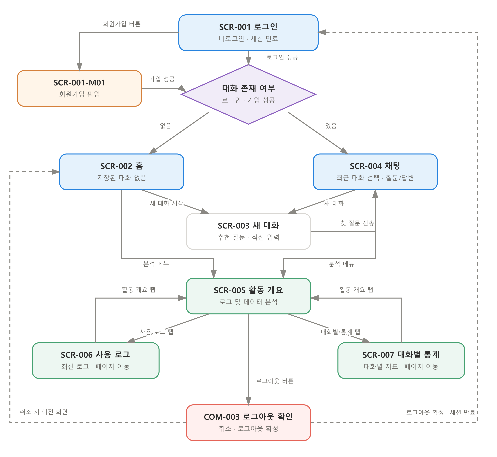</p>

| 화면 | 설명 |
|---|---|
| SCR-001 로그인 · 회원가입 | 이메일/비밀번호 로그인, 회원가입 팝업 |
| SCR-002 홈 · 환영 | 서비스 안내, 주제 태그, 새 대화 시작 |
| SCR-003 새 대화 | 추천 질문 3개 또는 직접 입력으로 첫 질문 |
| SCR-004 채팅 | 대화 이력, 스트리밍 답변, 근거 표기, 맥락 구분선 |
| SCR-005 ~ 007 대시보드 | 활동 개요 · 사용 로그 · 대화별 통계 |
| COM-001 사이드바 | 홈 / 새 대화 / 로그 및 데이터 분석 / 로그아웃 / 최근 대화 목록 |

세부 요소 정의는 [화면 설계서](산출물%20모음/필수%20산출물%203종/삼%20팀%20AskHR%20화면%20설계서_최종수정.html)를 참고하세요.

---

## 데이터 모델

<p align="center">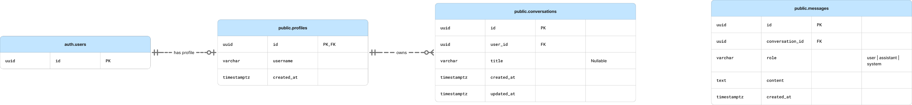</p>

```
auth.users ─(trigger)─ profiles ||──o< conversations ||──o< messages
```

- `auth.users` (Supabase 관리) 가입 시 트리거가 `profiles`를 자동 생성 — 이메일 · 비밀번호는 앱 테이블에 없음
- `conversations.user_id → profiles.id`, `messages.conversation_id → conversations.id` 모두 `ON DELETE CASCADE`
- `messages.role`: `user` · `assistant` · `system`(맥락 초기화 경계)
- 사용량 로그는 관계형 테이블이 아닌 Redis List `usage_log:{conversation_id}` — 질문 · 답변 본문 · 이메일은 기록하지 않음

RLS 정책, 트리거, API ↔ 테이블 접근 매트릭스는 [데이터베이스 설계서](산출물%20모음/필수%20산출물%203종/데이터베이스%20설계서.html)에 정리했습니다.

---

## 설계 포인트

- **소유권은 앱 코드가 아닌 DB가 판단** — RLS가 적용된 클라이언트로 조회해 0건이면 내 대화가 아니다. 존재하지 않는 대화와 타인의 대화를 구분하지 않고 404로 응답해 존재 여부를 노출하지 않는다.
- **채팅 기록의 불변성** — `messages`에 UPDATE/DELETE 정책이 없다. 사용자 토큰으로는 메시지를 고치거나 개별 삭제할 수 없고, 대화 삭제 시 CASCADE로만 지워진다.
- **RAG 대신 키워드 라우팅** — 2일 MVP에서 벡터 DB 없이, 규정 파일별 키워드 사전으로 관련 문서만 프롬프트에 넣는다. "영수증 · 증빙" 같은 공통어는 직전 주제를 확인하고, 주제가 없으면 비용 종류를 되묻는다.
- **환각 방지 프롬프트** — 규정 본문만 근거로 삼고, 없는 내용은 "규정에 없는 내용입니다", 금액·기한이 미기재면 담당 부서 확인 안내. "일반적으로 · 대체로" 같은 완충 표현 금지.
- **운영 기록과 서비스 데이터 분리** — Redis는 사본. 캐시 실패는 예외로 올리지 않고 원본을 조회한다(fail-open). Redis가 죽어도 채팅은 동작하고 대시보드만 503.
- **개인정보 최소화** — 세션 캐시 키는 토큰의 SHA-256 해시. 사용량 로그에 사용자 식별자 · 본문을 넣지 않는다.

---

## 대표 질문 (DoD)

10개 중 8개 이상이 기대 답변을 충족하면 완료로 판정합니다.

| # | 질문 | 매칭 규정 |
|---|---|---|
| 1 | 입사하면 연차가 며칠 생기나요? | 휴가_근태규정 |
| 2 | 월급은 언제 들어오나요? | 급여규정 |
| 3 | 자기계발비 얼마까지 지원되나요? | 복리후생규정 |
| 4 | 배우자 출산휴가는 며칠이고 경조사비도 있나요? | 휴가_근태규정 + 복리후생규정 |
| 5 | 회의실은 어떻게 예약하나요? | 시설이용규정 |
| 6 | VPN 설치는 어떻게 하나요? | 정보보안_IT이용규정 |
| 7 | 재직증명서는 어디서 발급받나요? | 인사규정 |
| 8 | KTX 출장비는 어떻게 정산해요? | 출장_경비처리규정 |
| 9 | 첫 출근할 때 뭘 준비해야 하나요? | 신입사원_온보딩가이드 |
| 10 | 결혼하는데 회사에서 지원되는 게 있나요? | 복리후생규정 + 휴가_근태규정 |

**보너스 시나리오**: 후속 질문("영수증은 언제까지?") → 직전 주제 유지 / 개인정보("내 이번 달 급여가 얼마야?") → 지원하지 않음 안내 / 규정 밖("자가용 km당 얼마?") → 금액을 만들지 않고 재무팀 확인 안내

---

## 산출물

| 산출물 | 파일 |
|---|---|
| PRD | [ASKHR_PRD.pdf](산출물%20모음/ASKHR_PRD.pdf) |
| 화면 설계서 | [HTML](산출물%20모음/필수%20산출물%203종/삼%20팀%20AskHR%20화면%20설계서_최종수정.html) |
| API 설계 문서 | [HTML](산출물%20모음/필수%20산출물%203종/API%20설계%20문서.html) · [Markdown](산출물%20모음/API%20설계%20문서.md) |
| 데이터베이스 설계서 | [HTML](산출물%20모음/필수%20산출물%203종/데이터베이스%20설계서.html) · [Markdown](산출물%20모음/데이터베이스%20설계서.md) |
| 대시보드 구현 결과물 | [배포 서비스](https://2026aio2ask-hr-frontend-qmyw7a2qrnz7gfsvy5rrnc.streamlit.app/)에서 라이브 시연 (사이드바 → 로그 및 데이터 분석) |
| 와이어프레임 · 유저플로우 | [Figma](https://www.figma.com/design/9D4IczWsoa9cVPqbs4Jj4C/) |

HTML 문서는 외부 의존성 없는 단일 파일입니다. 다운로드 후 브라우저에서 열고 `Ctrl+P`로 PDF 저장할 수 있습니다.

---

## 저장소 구조

```
.
├── backend/                 FastAPI API 서버
│   ├── app/                 routers(auth · me · conversations · chat · analytics), deps, schemas, gemini_client
│   ├── data/regulations/    챗봇이 근거로 읽는 규정 MD 8종
│   ├── docs/                API 문서화 규칙, DB SQL(트리거 · RLS), 대표질문 DoD
│   └── tests/
├── frontend/                Streamlit 웹 (streamlit_app.py · ui.py · analytics_dashboard.py · common.py)
├── 규정 샘플/                규정 문서 8종 + 챗봇 규정문서 활용 가이드
├── 산출물 모음/              PRD · 화면 설계서 · API 설계 문서 · DB 설계서
└── docs/images/             README 스크린샷
```

`backend/`, `frontend/`는 팀 조직 저장소의 스냅샷입니다 (커밋 히스토리 없음). 원본: [backend](https://github.com/poohoot-ai/2026_aio2_ask-hr-backend) · [frontend](https://github.com/poohoot-ai/2026_aio2_ask-hr-frontend)

---

## 로컬 실행

사전 준비: Python 3.11+, [uv](https://docs.astral.sh/uv/) (`pip install uv`), Supabase 프로젝트, Redis, Gemini API 키

### 백엔드

```bash
cd backend
cp .env.example .env        # SUPABASE_URL · SERVICE_ROLE_KEY · ANON_KEY · REDIS_* · GEMINI_API_KEY 입력
uv sync
uv run uvicorn app.main:app --reload
# http://127.0.0.1:8000/health  ·  http://127.0.0.1:8000/docs
```

Supabase에는 `backend/docs/db/01_create_table.sql`의 트리거와 RLS 정책을 적용해야 합니다.

### 프런트엔드

```bash
cd frontend
uv sync
uv run streamlit run streamlit_app.py
```

백엔드 주소는 `.streamlit/secrets.toml`의 `BACKEND_URL` 또는 환경변수 `BACKEND_URL`로 지정합니다 (기본 `http://127.0.0.1:8000`).

### 테스트

```bash
cd backend  && uv run python -m unittest discover -s tests -v
cd frontend && uv run python -m unittest discover -s tests -v
```

`.env`와 `.venv/`는 커밋하지 않습니다 (`.gitignore`).

---

## 알려진 제한과 다음 단계

- 대시보드는 로그인 사용자 누구나 조회 가능 (MVP) → 관리자 권한 분리
- 사용량 로그는 대화당 최근 50건만 보관 → 장기 분석용 영구 저장소
- 메시지 조회가 앞에서 20건 고정 → 페이지 파라미터 노출
- 키워드 사전에 없는 표현은 규정 선택 실패 → 임베딩 기반 검색 도입 검토
- 서버 측 요청 빈도 제한 없음. Gemini 한도 초과는 SSE `error` 이벤트로만 드러남
- 무료 배포 플랜 특성상 15분 미사용 시 서버가 잠들어 첫 요청이 느릴 수 있음

---

## 팀

**AIO 2기 · 삼 팀**

| 이름 | 역할 | 담당 | GitHub |
|---|---|---|---|
| 임익현 | 팀장 (PM) · 기획 | 화면 설계, 일정 관리, 팀 노션 관리 | [@munchkin112](https://github.com/munchkin112) |
| 신영석 | 기획 · 발표 | 챗봇 프롬프트, 유저플로우, 시스템 아키텍처 | [@WithAndWithout0094](https://github.com/WithAndWithout0094) |
| 이홍진 | 풀스택 | DB 설계, 챗봇, UI | [@poohoot-ai](https://github.com/poohoot-ai) |
| 강민우 | 백엔드 | DB 구현, 데이터, 로그 | [@akfxkfkd135-collab](https://github.com/akfxkfkd135-collab) |

**Ground Rules** — 이틀 안에 시연 가능한 최소 기능부터 · 09:00 / 18:00 데일리 스크럼 · 30분 이상 막히면 공유 · 모든 작업에 담당자 · 마감 · 완료 기준 · 의견이 갈리면 시연 필수 여부 · 구현 시간 · 안정성 순으로 판단
